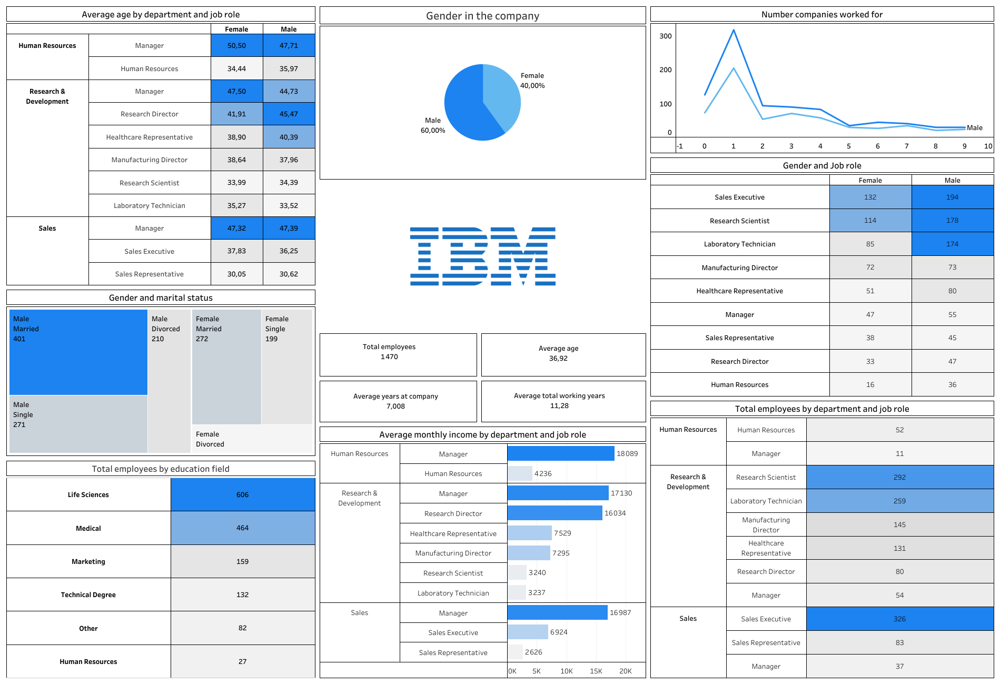

# 📊 IBM HR Analytics – Tableau Dashboard

## Description du projet
Ce projet présente une analyse exploratoire des données RH d’IBM réalisée avec **Tableau**.  
L’objectif est de fournir une vue d’ensemble claire de la population de l’entreprise, en mettant en évidence les aspects démographiques, organisationnels et salariaux afin de soutenir la prise de décision RH.

Le dashboard est entièrement interactif et permet d’analyser les effectifs selon plusieurs dimensions clés : département, poste, genre, âge, ancienneté et niveau d’éducation.

---

## 📈 Indicateurs clés analysés
- Répartition des employés par **genre**
- Analyse du **statut marital** par genre
- **Âge moyen** par département et par rôle
- Nombre total d’employés par **département** et **poste**
- **Salaire mensuel moyen** par département et par rôle
- Ancienneté moyenne dans l’entreprise
- Nombre d’entreprises précédemment fréquentées
- Répartition des employés par **niveau d’éducation**

---
## 📈 Dashboard Overview

## 🌐 Accès au dashboard interactif
👉 **Tableau Public** :  
[https://public.tableau.com/app/profile/TON_NOM/viz/NOM_DU_DASHBOARD](https://public.tableau.com/views/HRIBManalyticsdashboard/Tableaudebord1?:language=fr-FR&:sid=&:redirect=auth&:display_count=n&:origin=viz_share_link)

---

## 🎯 Objectif du projet
Ce projet a été réalisé dans le cadre d’un **portfolio Data Analyst**, avec pour objectif de démontrer la capacité à :
- Explorer et synthétiser des données RH
- Concevoir un dashboard clair et structuré
- Mettre en valeur des indicateurs pertinents pour les équipes métier
