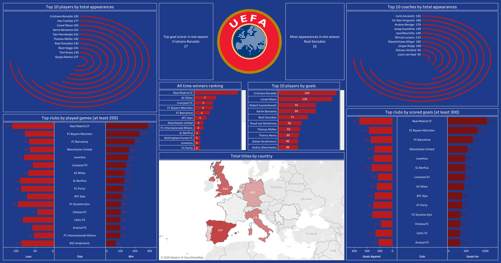

# ⚽ UEFA Champions League – Tableau Dashboard

## Description du projet
Ce projet consiste en une analyse complète de l’histoire de la **UEFA Champions League** à l’aide de **Tableau**.  
Le dashboard met en lumière les performances des **joueurs**, **entraîneurs**, **clubs** et **pays** à travers différentes statistiques historiques.

L’objectif est de proposer une visualisation claire, interactive et synthétique des records et classements majeurs de la compétition.

---

## 📊 Analyses et indicateurs clés
- **Top 10 des joueurs** par :
  - Nombre total d’apparitions
  - Nombre total de buts
- Record de **buts marqués sur une seule saison**
- Record de **matchs joués sur une seule saison**
- **Top 10 des entraîneurs** par nombre total d’apparitions
- Classement des **clubs les plus titrés** de l’histoire
- Clubs avec le plus grand nombre de **matchs joués**
- Clubs avec le plus grand nombre de **buts marqués** 
- Comparaison **buts marqués vs buts encaissés** par club
- Répartition géographique des **titres par pays** 

---

## 📈 Dashboard Overview

## 🌐 Accès au dashboard interactif
👉 **Tableau Public** :  
https://public.tableau.com/shared/H2WNDD8N9?:display_count=n&:origin=viz_share_link

## 🎯 Objectif du projet
Ce projet a été réalisé dans le cadre d’un **portfolio Data Analyst / Data Visualization**, avec pour objectifs de :
- Transformer des données sportives complexes en insights clairs
- Concevoir un dashboard riche tout en restant lisible
- Mettre en valeur des indicateurs historiques et comparatifs
- Démontrer une maîtrise avancée de **Tableau** et du storytelling visuel

