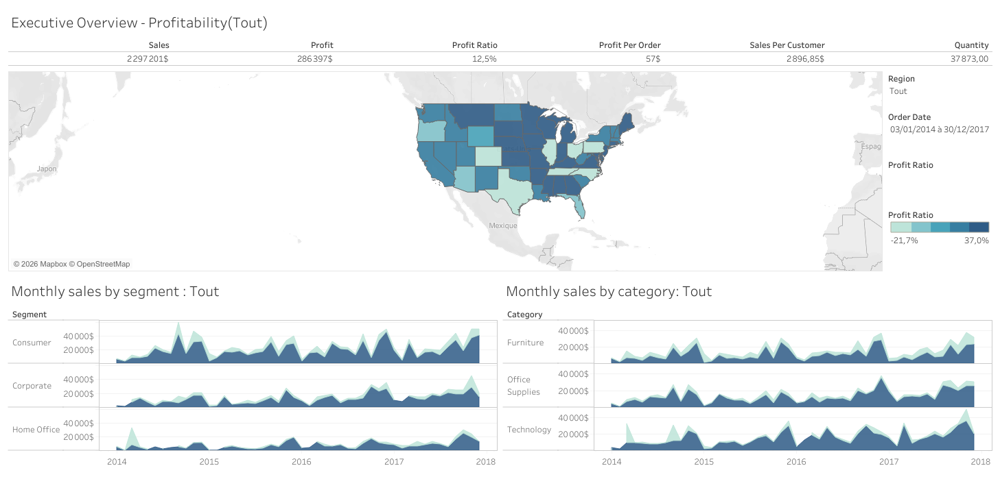

# Superstore Dashboard – Executive Overview

## Project Overview
This project presents an **executive-level Tableau dashboard** built using the Superstore dataset.  
The goal is to analyze **sales performance and profitability** across regions, segments, and product categories to support strategic business decisions.

## 🗂️ Dataset
- Source: Sample Superstore dataset
- Tables used:
  - **Orders** 
  - **Returns**
- Period: January 2014 – December 2017
- Geography: United States

## 🛠️ Tools & Technologies
- Tableau Desktop
- Data modeling & joins
- Calculated fields
- Filters and parameters
- Data visualization best practices

## 📈 Dashboard Overview

